# Face-Mask-Detection-
A Real-time face mask detection system using webcam and static image uploads. Detects if a person is wearing a mask or not, provides voice alerts, sends WhatsApp image alerts for violations, logs geotagged incidents, displays a heatmap of locations, and generates a compliance report of mask violations and adherence.
## 🔐 Login Page

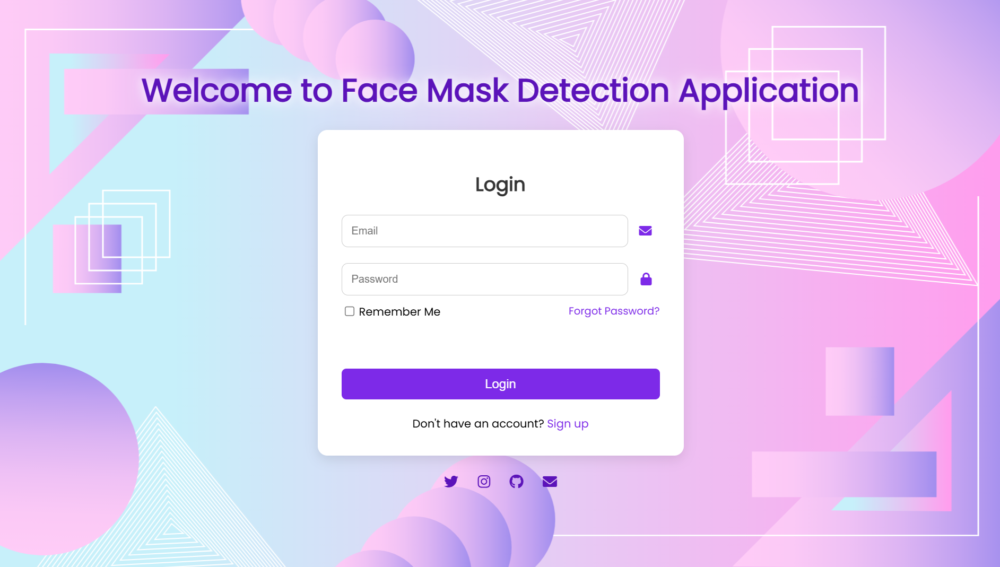

## 🧭 Dashboard

 

- 📸 Detects faces & identifies mask usage (Mask / No Mask)
- 🌐 Real-time webcam or static image detection
- 🔊 Voice feedback for compliance and Violations
- 📲 Sends **WhatsApp alerts** with face snapshots when violations occur
- 🗺️ Heatmap of violation locations based on GPS
- 📊 Tracks compliance & violations daily,weekly,monthly via dashboard

## 📸 Live web Cam Detection 

Real-time mask detection using webcam feed. 

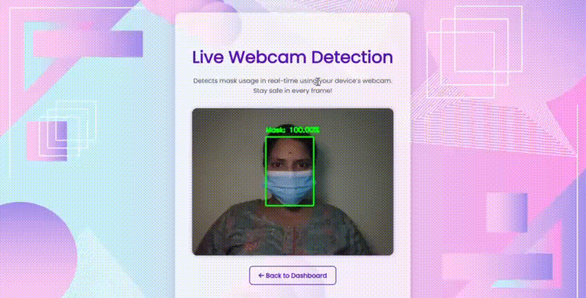

## 📸 Static Image Detection

You can upload an image and the system will:

- Detect faces
- Identify if a mask is worn
- Display bounding boxes and confidence scores
- Log the result

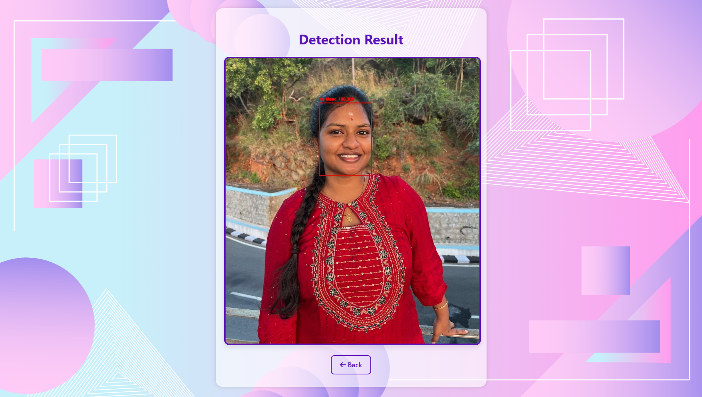 

## 🗺️ Geolocation & Heatmap Visualization 

Logged violations are shown on an interactive map based on their GPS coordinates. 

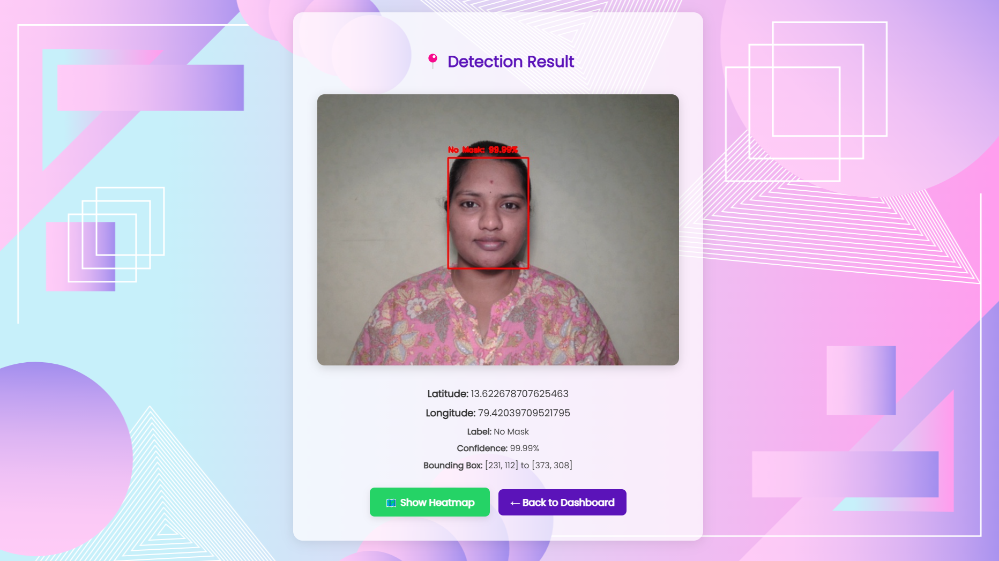  

Visualizes past violations on a location map using intensity colors.

- 🔴 Red = multiple violations
- 🟡 Yellow = few violations
- 🟢 Green = low/no violations

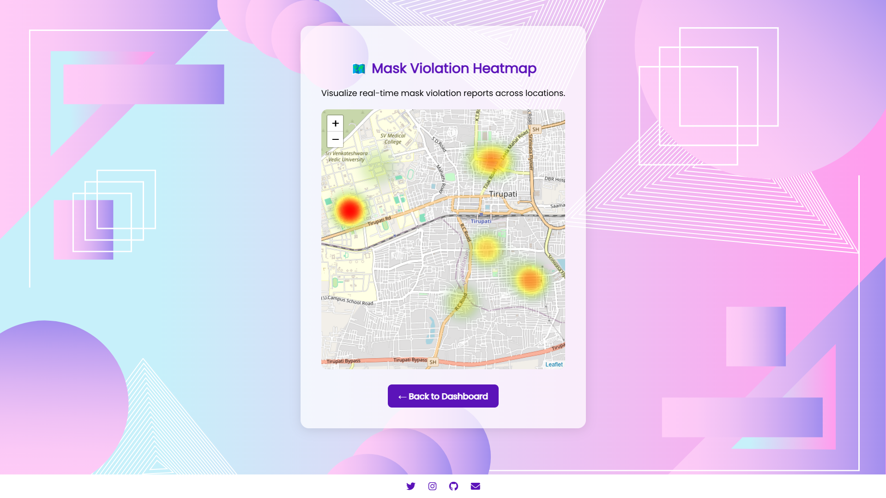

## 📱 WhatsApp  Alerts

- If a violation is detected:
  - WhatsApp image alert sent to registered number
  - All results shown on-screen with labeled bounding box

 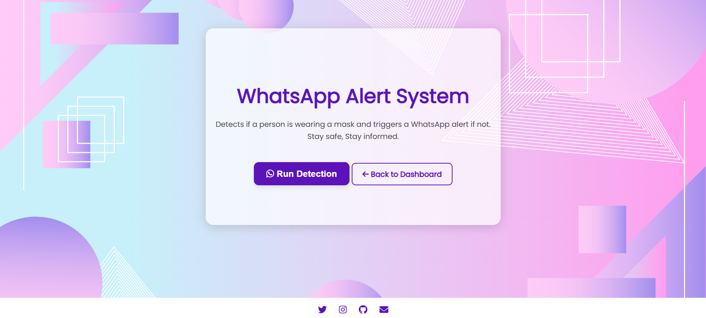 
 
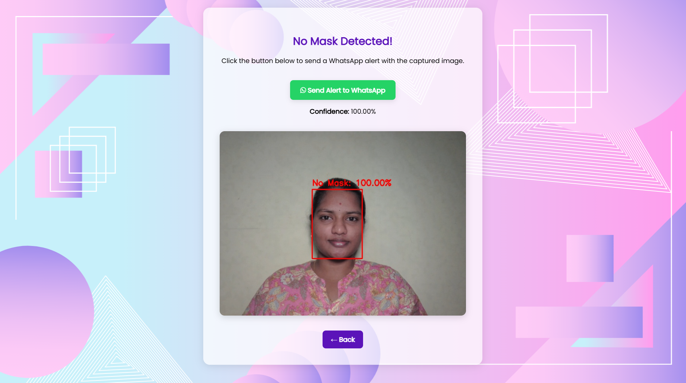 

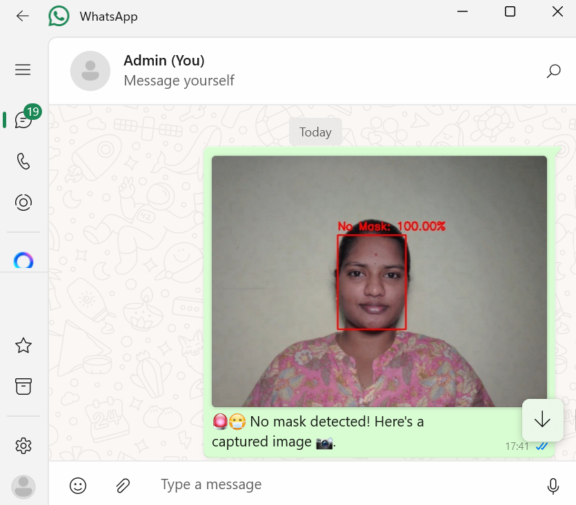

## 📢 Voice Alerts

- If a violation is detected:
  - 🔊 Voice message plays from dropdown selection
  - All results shown on-screen with labeled bounding box

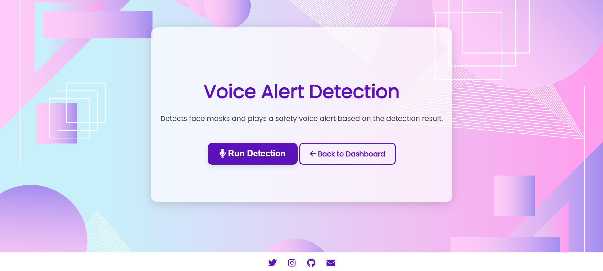 

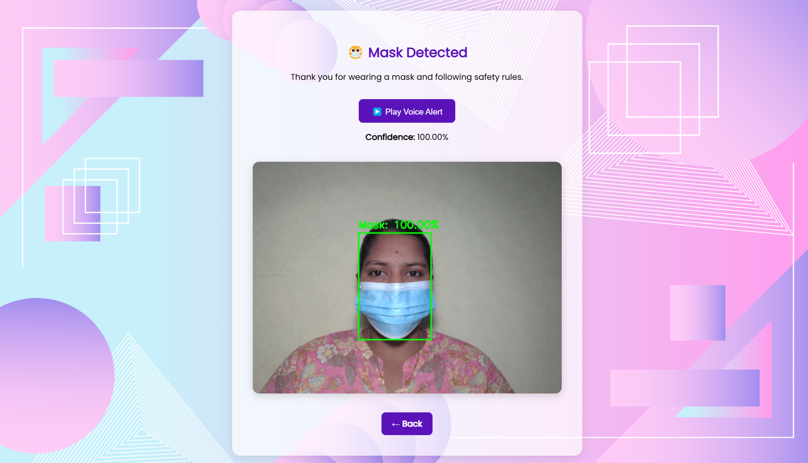 

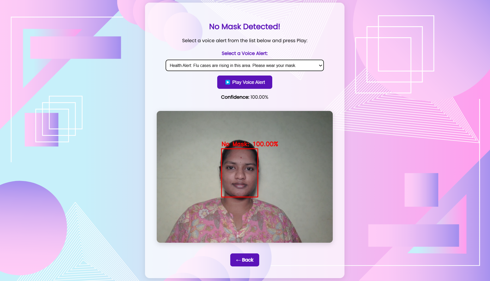

## 📊 Compliance Tracker

Automatically logs all events:
- Date, time, mask status, confidence, GPS
- Counts violations vs compliance

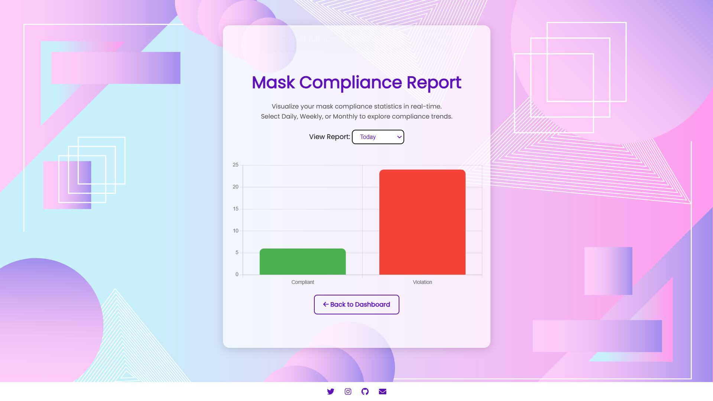

## 🧠 Model Details
- Face Detection: OpenCV SSD with Caffe model
- Mask Classification: Trained with ResNet50V2 / MobileNetV2
- Image Size: 224x224 RGB
- Framework: TensorFlow + Keras

## 📧 Contact & Credits
- Developer: Pavani Sree
- Project: Face Mask Detection and  Compliance System with GeoTagged Heat Map Visualization and Automated Alerts.
- GitHub: https://github.com/pvnisre
- Email: pavanisree8055@gmail.com
